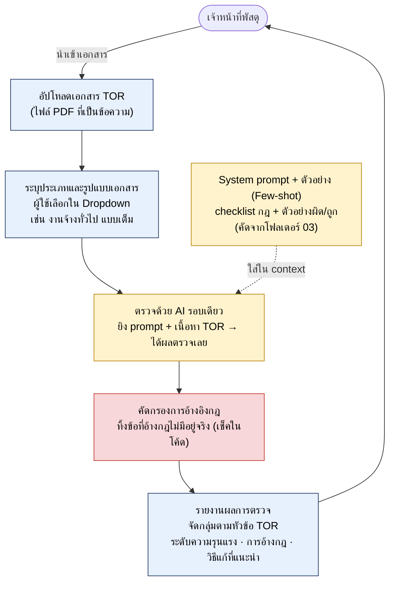
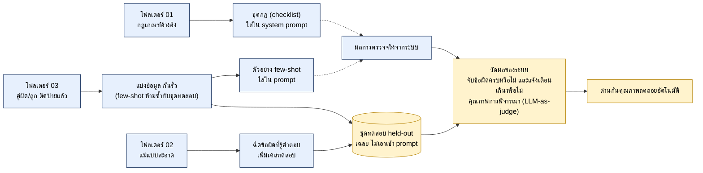

# TORDIT — Architecture Diagram

## Pipeline หลัก (MVP — few-shot รอบเดียว)

แนวทาง MVP: ตรวจด้วย AI รอบเดียวล้วน ใช้ few-shot สอนจากตัวอย่างผิด/ถูกจริง ไม่มี rule engine แยก เพื่อให้ทำเสร็จทันสาธิต · กล่อง**แดง** (คัดกรองการอ้างอิง) เป็นโค้ดสั้นๆ กันการอ้างกฎมั่วที่ทำลายความน่าเชื่อถือ · ถ้าภายหลังเช็คตัวเลขเป๊ะๆ ไม่นิ่ง ค่อยเติมการตรวจตัวเลขแบบกฎตายตัวเสริมได้

## ฝั่งข้อมูลและการวัดผล

จุดสำคัญฝั่งข้อมูล: ตัวอย่างที่เอาไปใส่ few-shot **ห้ามซ้ำ** กับชุดที่ใช้วัดผล (held-out) ไม่งั้นคะแนนจะหลอกตา
